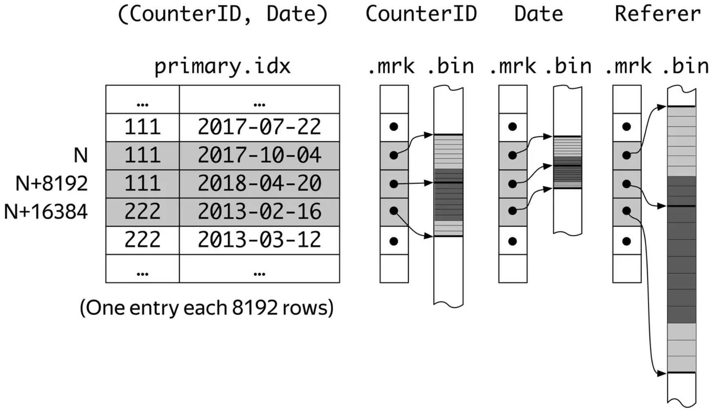
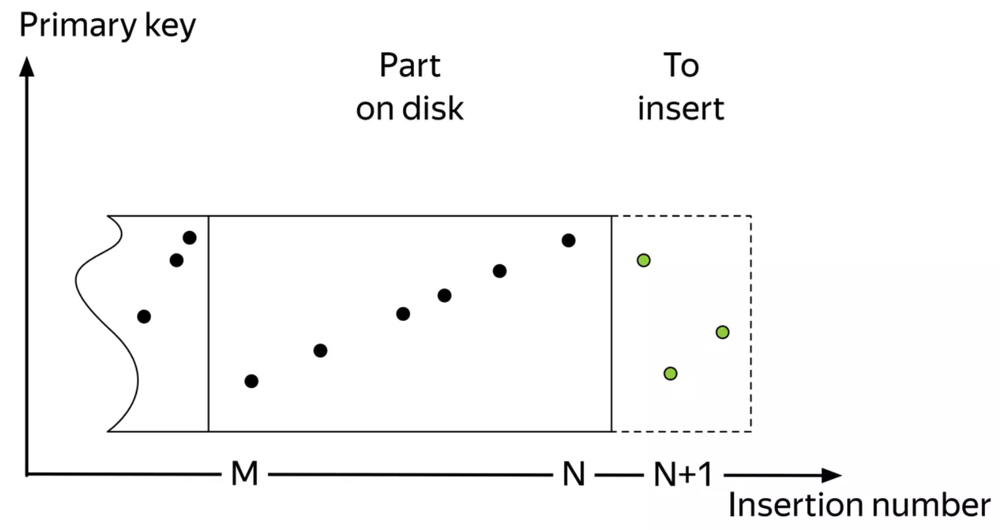
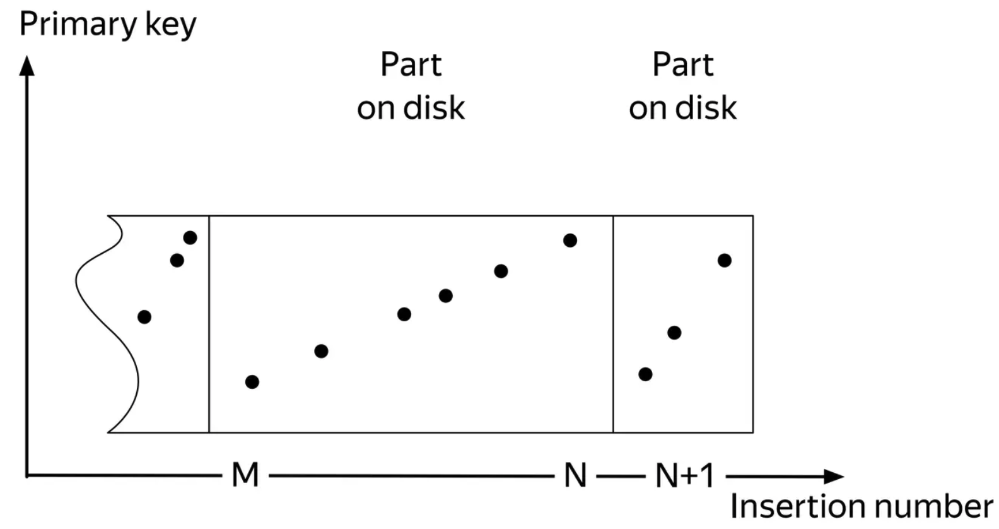
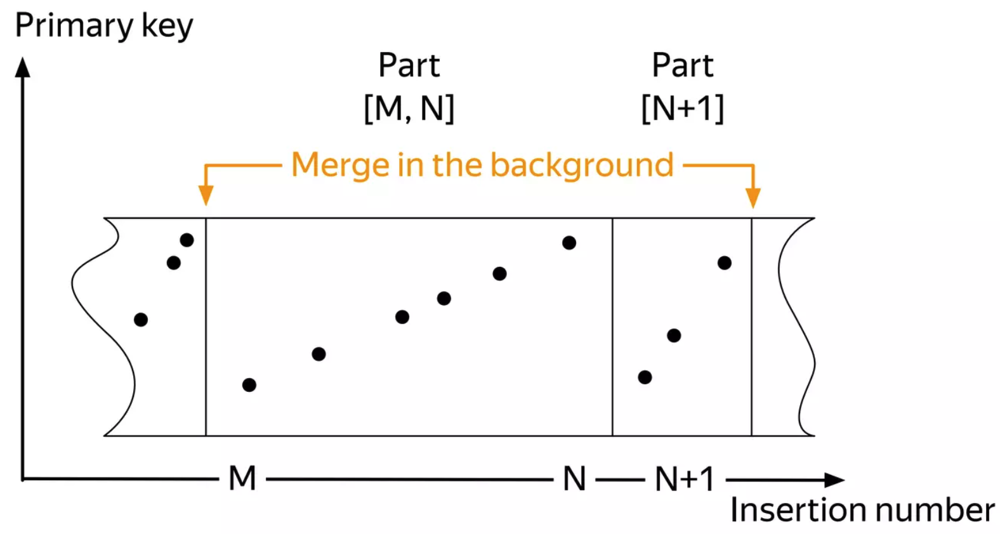
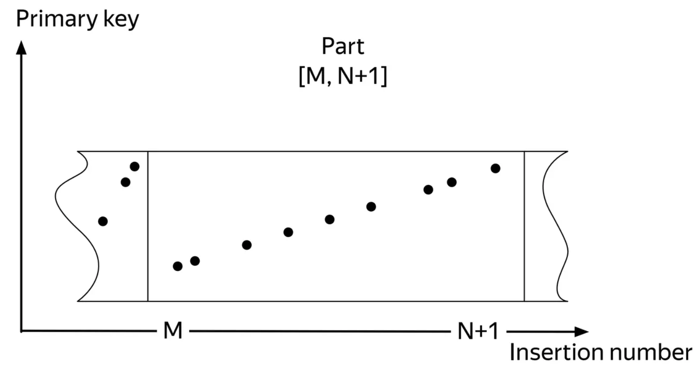
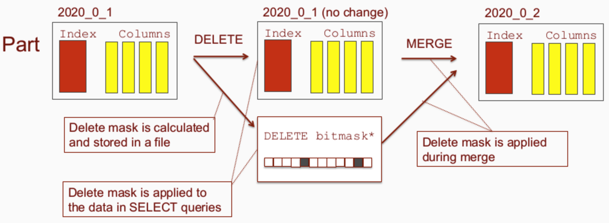

# ClickHouse Internals

Qin Liu, Moqi Inc.
qliu@moqi.ai

<!--
_footer: Most slides are taken from [Aleksei Milovidov](https://www.slideshare.net/Altinity/clickhouse-deep-dive-by-aleksei-milovidov)
-->

---

## ClickHouse use cases

A stream events

- Actions of website visitors (Yandex Metrica)
- Ad impressions
- DNS queries
- E-commerce transactions

We want to save info about these events and then glean some insights from it

---

## ClickHouse philosophy

- Interactive queries on data updated in real time
- Cleaned structured data is needed
- Try hard not to pre-aggregate anything
- Query language: a dialect of SQL + extensions

---

## Sample query in a web analytics system

Top-10 referers for a website for the last week:

```sql
SELECT Referer, count(*) AS count
FROM hits
WHERE CounterID = 111
AND Date BETWEEN '2023-03-13' AND '2023-03-19'
GROUP BY Referer
ORDER BY count DESC
LIMIT 10
```

---

## How to execute a query fast?

Read data fast

- Only needed columns: `CounterID`, `Date`, `Referer`
- Locality of reads (an index is needed!)
- Data compression

Process data fast

- Vectorized execution (block-based processing)
- Parallelize to all available cores and machines
- Specialization and low-level optimizations

---

## Index needed

The principle is the same as with classic DBMSes

- A majority of queries will contain conditions on `CounterID` and (possibly) `Date`

`(CounterID, Date)` fits the bill

- Check this by mentally sorting the table by primary key

Differences

- The table will be physically sorted on disk
- **Is not** a unique constraint

---

## Index Internals



---

## Things to remember about indexes

Index is sparse

- Must fit into memory

- Default value of granularity (8192) is good enough
- Does not create a unique constraint
- Performance of point queries is not stellar

Table is sorted according to the index

- There can be only one
- Using the index is always beneficial

---

## How to keep the table sorted

Inserted events are (almost) sorted by time

- But we need to sort by primary key!

MergeTree: maintain a small set of sorted parts

- Similar idea to an LSM tree

---

## How to keep the table sorted



---

## How to keep the table sorted



---

## How to keep the table sorted



---

## How to keep the table sorted



---

## Things to do while merging

Replace/update records

- ReplacingMergeTree
- CollapsingMergeTree

Pre-aggregate data

- AggregatingMergeTree

Metrics rollup

- GraphiteMergeTree

---

## MergeTree partitioning

`ENGINE = MergeTree ... PARTITION BY toYYYYMM(Date)`

- Table can be partitioned by any expression (default: by month)
- Parts from different partitions are not merged
- Easy manipulation of partitions

  ```sql
  ALTER TABLE DROP PARTITION
  ALTER TABLE DETACH/ATTACH PARTITION
  ```

- MinMax index by partition columns

---

## Things to remember about MergeTree

Merging runs in the background

- Even when there are no queries!

Control total number of parts

- Rate of INSERTs
- `MaxPartsCountForPartition` and `DelayedInserts` metrics are your friends

---

## Delete and update

Delete and update are very expensive

- The entire part that contains the deleted/updated rows must be updated
- Parts can be quite large after merging

---

## Lightweight delete

Added by Jianmei Zhang from Moqi, [#37893](https://github.com/ClickHouse/ClickHouse/pull/37893)

